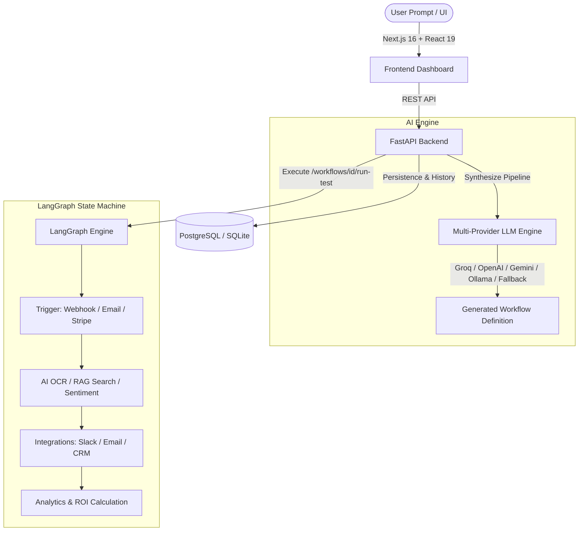

# ⚡ SmartFlow AI — Enterprise AI Workflow Automation Platform

SmartFlow AI is an autonomous, full-stack business workflow automation engine tailored for SMBs and enterprise teams. It turns natural language business prompts into structured, multi-step state machines powered by **LangGraph**, integrates document intelligence, RAG vector search, third-party triggers & dispatchers, and delivers real-time ROI tracking.

---

## 🌟 Key Features

- **🤖 Multi-Provider AI Workflow Generator**:
  - Automatically synthesizes complex multi-node automation pipelines from natural language prompts.
  - Supports **Groq Cloud (Llama 3.3 70B)**, **OpenAI (GPT-4o-mini)**, **Google Gemini 2.0**, **Local Ollama**, and an **Intelligent Offline Semantic Rule Engine**.
- **🛠️ Interactive Drag-and-Drop Workflow Builder**:
  - Reorder, customize, add, and remove LangGraph nodes on a visual sortable canvas.
  - Rich node catalog: Webhooks, Email triggers, Stripe billing, Document OCR extraction, RAG vector lookup, AI decision gates, Slack notifications, and WhatsApp alerts.
- **⚡ Live LangGraph State Machine Execution**:
  - Real-time pipeline simulation with step-by-step trace inspection, execution duration (ms), input/output payloads, and estimated labor hours saved.
- **📊 Business ROI & Analytics Dashboard**:
  - Executive KPI cards (AI tasks executed, active automations, hours saved, success rate).
  - Interactive Recharts performance trend charts and category distributions.
- **📚 Pre-Built SMB Automation Templates**:
  - 1-click clone enterprise-grade templates: AI Invoice Scanner, Customer Support Triage, Inbound Lead Scoring, Stripe Failed Payment Dunning, and Negative Review Escalation.
- **🗄️ Resilient Database Architecture**:
  - Out-of-the-box zero-configuration **SQLite** for local development + seamless **PostgreSQL (pgvector)** support for Supabase, Neon, and Docker.

---

## 🏗️ Architecture



---

## 🚀 Quickstart (Local Development)

### 1. Clone & Setup Backend

```bash
cd backend
python -m venv .venv

# Activate virtualenv:
# On Windows:
.venv\Scripts\activate
# On macOS/Linux:
source .venv/bin/activate

pip install -r requirements.txt
uvicorn app.main:app --reload --port 8000
```
Backend API will start at `http://localhost:8000` (Swagger docs at `http://localhost:8000/docs`).

### 2. Setup Frontend

```bash
cd frontend
npm install
npm run dev
```
Open `http://localhost:3000` in your browser.

---

## 🌐 100% Free Cloud Deployment

SmartFlow AI is pre-configured to be deployed for **$0 / month** on modern free-tier platforms:

- **Frontend**: Deploy on [Vercel](https://vercel.com) with 1 click.
- **Backend**: Deploy on [Render.com](https://render.com) using the included `render.yaml` or `Dockerfile`.
- **Database**: Connect free PostgreSQL on [Supabase](https://supabase.com) or [Neon.tech](https://neon.tech), or use built-in SQLite.
- **AI Engine**: Free API key from [Groq Cloud Console](https://console.groq.com/keys) (Llama 3.3 70B).

👉 **[Read the Full Free Deployment Guide](./DEPLOYMENT_GUIDE.md)** for step-by-step instructions.

---

## 📂 Project Structure

```
Business_WorkFlow_Automation_Platform/
├── backend/
│   ├── app/
│   │   ├── config.py              # Configuration & multi-LLM env settings
│   │   ├── db.py                  # Resilient SQLAlchemy DB connector (SQLite + Postgres)
│   │   ├── models.py              # Workflow & WorkflowRun execution history models
│   │   ├── schemas.py             # Pydantic schemas
│   │   ├── routers/
│   │   │   └── workflows.py       # Full CRUD, template cloning, test execution & analytics
│   │   └── services/
│   │       ├── agent_graph.py     # Multi-provider AI generation & LangGraph state machine
│   │       ├── templates.py       # Catalog of pre-built SMB workflows
│   │       └── rag.py             # Vector RAG retrieval service
│   ├── Dockerfile                 # Production Docker image
│   ├── requirements.txt           # Python dependencies
│   └── .env.example               # Backend environment variables template
├── frontend/
│   ├── src/
│   │   ├── app/
│   │   │   ├── layout.tsx         # Root layout
│   │   │   ├── page.tsx           # Dashboard view
│   │   │   └── globals.css        # Tailwind CSS styles
│   │   ├── components/
│   │   │   └── dashboard.tsx      # Comprehensive SaaS dashboard & Drag-and-Drop builder
│   │   └── lib/
│   │       └── api.ts             # Typed Axios API client & models
│   ├── package.json               # Next.js 16 + React 19 dependencies
│   └── postcss.config.mjs         # PostCSS & Tailwind v4 config
├── render.yaml                    # 1-click Render.com deployment blueprint
├── DEPLOYMENT_GUIDE.md            # Step-by-step free deployment walkthrough
└── README.md                      # Project documentation
```

